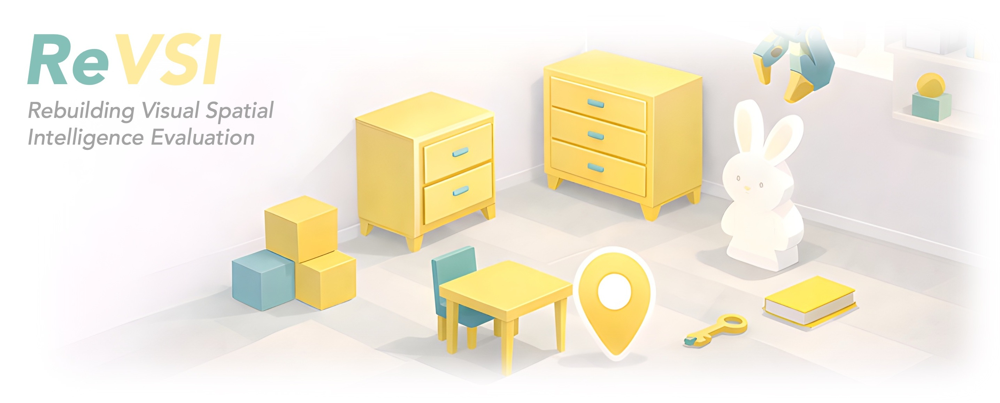

<p align="left">
  
</p>

[Yiming Zhang](https://github.com/eamonn-zh)<sup>1*</sup>,
[Jiacheng Chen](https://jcchen.me/)<sup>1*</sup>,
[Jiaqi Tan](https://christinatan0704.github.io/mysite/)<sup>1</sup>,
[Yongsen Mao](https://sammaoys.github.io/)<sup>2</sup>,
[Wenhu Chen](https://wenhuchen.github.io/)<sup>3</sup>,
[Angel X. Chang](https://angelxuanchang.github.io/)<sup>1,4</sup>

<sup>1</sup> Simon Fraser University &nbsp;&nbsp;
<sup>2</sup> Hong Kong University of Science and Technology
<br>
<sup>3</sup> University of Waterloo &nbsp;&nbsp;
<sup>4</sup> Alberta Machine Intelligence Institute (Amii)


[](https://3dlg-hcvc.github.io/revsi/)
[](https://arxiv.org/abs/2604.24300)
[](https://revsi.site/)
[](https://huggingface.co/datasets/3dlg-hcvc/ReVSI/)
  
This repository contains code for the ReVSI benchmark, introduced in [ReVSI: Rebuilding Visual Spatial Intelligence Evaluation for Accurate Assessment of VLM 3D Reasoning](https://3dlg-hcvc.github.io/revsi/).


## Evaluation
> Please avoid using PyTorch 2.9, as a known cuDNN issue can lead to significant performance degradation for QwenVL models (see [details](https://github.com/pytorch/pytorch/issues/166122)).

ReVSI supports inference / evaluation with the following frameworks:
- [LMMs-Eval](https://github.com/eamonn-zh/lmms-eval)
  ```bash
  # example 1: evaluate Qwen3-VL-8B-Instruct on ReVSI 64-frame subset (with huggingface transformers backend on 4 GPUs)
  accelerate launch \
  --num_processes=4 \
  -m lmms_eval \
  --model qwen3_vl \
  --model_args=pretrained=Qwen/Qwen3-VL-8B-Instruct,attn_implementation=flash_attention_2,max_num_frames=64 \
  --tasks revsi_64_frame \
  --batch_size 8
  
  # example 2: evaluate Qwen3-VL-8B-Instruct on ReVSI all-frame subset using 2 fps sampling rate (with vllm backend)
  python -m lmms_eval \
  --model vllm \
  --model_args "model=Qwen/Qwen3-VL-8B-Instruct,fps=2" \
  --tasks revsi_all_frame
  ```

- [VLMEvalKit](https://github.com/eamonn-zh/VLMEvalKit) (inference + evaluation)
  ```bash
  # example 1: evaluate Qwen3-VL-8B-Instruct on ReVSI 32-frame subset (with vllm backend)
  python run.py --data revsi_32_frame --model Qwen3-VL-8B-Instruct
  ```

- [ModelScope SWIFT](https://github.com/modelscope/ms-swift) (inference-only)
  ```bash
  # example 1: infer Qwen3-VL-8B-Instruct on ReVSI 64-frame subset (with huggingface transformers backend on 4 GPUs)
  NPROC_PER_NODE=4 swift infer \
  --model Qwen/Qwen3-VL-8B-Instruct  \
  --model_kwargs '{"fps_min_frames": 64, "fps_max_frames": 64}' \
  --val_dataset 3dlg-hcvc/ReVSI:64_frame \
  --infer_backend transformers \
  --custom_register_path ./ms_swift_register/revsi_register.py \
  --use_hf true \
  --torch_dtype bfloat16 \
  --attn_impl flash_attention_2 \
  --strict true \
  --max_batch_size 8 \
  --temperature 0 \
  --result_path results.jsonl
  ```

- [TorchMetrics Extension](https://github.com/eamonn-zh/torchmetrics_ext) (evaluation-only)
  ```python
  # example 1: evaluate existing predictions on ReVSI all-frame subset using TorchMetrics Extension evaluator
  from torchmetrics_ext.metrics.vqa import ReVSIMetric

  metric = ReVSIMetric(subset="all_frame")
  predictions = {0: "2", 1: "4", ..., 1000: "A"}  # predictions should be a dict following the format {question_id: response}
  results = metric(pred_dict)
  ```


## Question-Answer Pair Generation
Our generation pipeline is largely adapted from the data generation scripts of [VSI-Bench](https://vision-x-nyu.github.io/thinking-in-space.github.io/). The scripts in `qa_generation/` produce question–answer CSV files from the ReVSI 3D annotation metadata, and each script can be run independently.

Install the geometry-related dependencies before running the generation scripts:
```bash
pip install numpy tqdm shapely scipy open3d point-cloud-utils
```

The scripts generate the following question types:

| Script | Question type |
| --- | --- |
| `obj_count_single_qa.py` | `object_counting_single` |
| `obj_count_multiple_qa.py` | `object_counting_multiple` |
| `obj_size_qa.py` | `object_size_estimation` |
| `room_size_qa.py` | `room_size_estimation_single`, `room_size_estimation_multiple` |
| `obj_abs_dist_qa.py` | `object_abs_distance` |
| `obj_rel_dir_qa.py` | `object_rel_direction_forward_easy`, `object_rel_direction_backward_easy`, `object_rel_direction_forward_hard`, `object_rel_direction_backward_hard` |
| `obj_rel_dist_closest_qa.py` | `object_rel_distance_closest` |
| `obj_rel_dist_farthest_qa.py` | `object_rel_distance_farthest` |


> QA pairs released with ReVSI underwent additional human review and curation; therefore, the scripts above are intended to reproduce the generation pipeline rather than the exact released QA pairs.

## Citation
If you find ReVSI useful for your research, please consider citing:
```bibtex
@article{zhang2026revsi,
  title={ReVSI: Rebuilding Visual Spatial Intelligence Evaluation for Accurate Assessment of VLM 3D Reasoning},
  author={Zhang, Yiming and Chen, Jiacheng and Tan, Jiaqi and Mao, Yongsen and Chen, Wenhu and Chang, Angel X.},
  journal={arXiv preprint arXiv:2604.24300},
  year={2026}
}
```

ReVSI builds upon the following 3D scene datasets and the VSI-Bench benchmark, please also consider citing:
```bibtex
@inproceedings{dai2017scannet,
  title={Scannet: Richly-annotated 3d reconstructions of indoor scenes},
  author={Dai, Angela and Chang, Angel X and Savva, Manolis and Halber, Maciej and Funkhouser, Thomas and Nie{\ss}ner, Matthias},
  booktitle={Proceedings of the IEEE conference on computer vision and pattern recognition},
  pages={5828--5839},
  year={2017}
}

@inproceedings{yeshwanth2023scannet++,
  title={Scannet++: A high-fidelity dataset of 3d indoor scenes},
  author={Yeshwanth, Chandan and Liu, Yueh-Cheng and Nie{\ss}ner, Matthias and Dai, Angela},
  booktitle={Proceedings of the IEEE/CVF International Conference on Computer Vision},
  pages={12--22},
  year={2023}
}

@inproceedings{baruch1arkitscenes,
  title={ARKitScenes: A Diverse Real-World Dataset For 3D Indoor Scene Understanding Using Mobile RGB-D Data},
  author={Baruch, Gilad and Chen, Zhuoyuan and Dehghan, Afshin and Feigin, Yuri and Fu, Peter and Gebauer, Thomas and Kurz, Daniel and Dimry, Tal and Joffe, Brandon and Schwartz, Arik and others},
  booktitle={Thirty-fifth Conference on Neural Information Processing Systems Datasets and Benchmarks Track (Round 1)}
}

@inproceedings{wald2019rio,
  title={Rio: 3d object instance re-localization in changing indoor environments},
  author={Wald, Johanna and Avetisyan, Armen and Navab, Nassir and Tombari, Federico and Nie{\ss}ner, Matthias},
  booktitle={Proceedings of the IEEE/CVF International Conference on Computer Vision},
  pages={7658--7667},
  year={2019}
}

@article{mao2022multiscan,
  title={Multiscan: Scalable rgbd scanning for 3d environments with articulated objects},
  author={Mao, Yongsen and Zhang, Yiming and Jiang, Hanxiao and Chang, Angel and Savva, Manolis},
  journal={Advances in neural information processing systems},
  volume={35},
  pages={9058--9071},
  year={2022}
}

@inproceedings{yang2025thinking,
  title={Thinking in space: How multimodal large language models see, remember, and recall spaces},
  author={Yang, Jihan and Yang, Shusheng and Gupta, Anjali W and Han, Rilyn and Fei-Fei, Li and Xie, Saining},
  booktitle={Proceedings of the Computer Vision and Pattern Recognition Conference},
  pages={10632--10643},
  year={2025}
}
```
